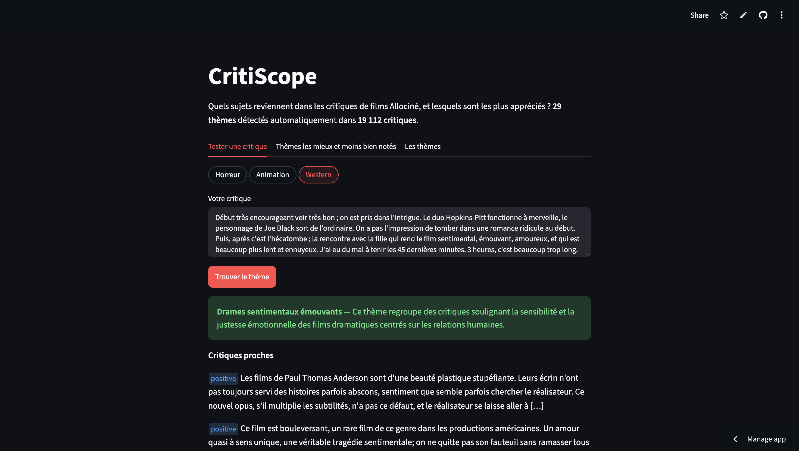

# CritiScope


Quels sujets reviennent dans les critiques de films Allociné, et lesquels sont les mieux notés ?

**[Démo en ligne](https://critiscope-allocine.streamlit.app/)** · [Modèle et artefacts sur Hugging Face](https://huggingface.co/Dalfaxy/critiscope-bertopic)



## Méthode

- **Données** : 19 112 critiques du jeu [`tblard/allocine`](https://huggingface.co/datasets/tblard/allocine), avec leur label positif / négatif.
- **Prétraitement** : nettoyage léger pour les embeddings ; lemmatisation spaCy et stopwords métier pour les mots-clés et LDA.
- **Thèmes** : BERTopic sur des embeddings `multilingual-e5-large-instruct` (instruction orientée genre et sujet), UMAP + HDBSCAN, mots-clés c-TF-IDF + MMR.
- **Sentiment** : part d'avis positifs par thème, test binomial avec correction de Benjamini-Hochberg.
- **Baseline** : LDA (gensim) évaluée avec les mêmes tokens et le même dictionnaire.
- **Étiquettes** : générées hors ligne par `gemini-3.1-flash-lite`.

## Résultats

**29 thèmes**, dont 27 de sujet (genres, cinémas nationaux, thématiques) et 2 de ton (déception, chef-d'œuvre).

| Plus appréciés | Avis positifs | Plus sévères | Avis positifs |
|---|---|---|---|
| Drames sentimentaux | 84 % | Téléfilms | 19 % |
| Cinéma social engagé | 83 % | Scènes sexuelles explicites | 27 % |
| Films noirs et gangsters | 72 % | Blockbusters | 30 % |
| Documentaires | 69 % | Films d'horreur | 37 % |

- 21 thèmes sur 29 sont significativement liés au sentiment (5 plus négatifs, 16 plus positifs) ; V de Cramér = 0,51.
- Moyenne du corpus : 50,7 % d'avis positifs.

| Modèle | Thèmes | NPMI | C_V | Diversité |
|---|---|---|---|---|
| **BERTopic** | 29 | -0,021 | **0,492** | 0,70 |
| LDA | 29 | -0,053 | 0,385 | 0,71 |
| LDA (meilleur K) | 20 | **-0,015** | 0,434 | 0,77 |

À nombre de thèmes égal, BERTopic est plus cohérent que LDA, et ses thèmes sont nettement plus lisibles. La NPMI, proche de 0 pour tous les modèles sur ces textes courts, pénalise les mots précis mais rares de ses petits thèmes.

## Reproduire

```bash
uv sync
uv run python -m src.data --n 20000
uv run python -m src.preprocessing --n 20000
uv run python -m src.embeddings --n 20000
uv run python -m src.train_bertopic --n 20000
uv run python -m src.sentiment_analysis
uv run python -m src.train_lda
uv run python -m src.evaluate
uv run python -m src.label_topics
uv run python -m src.export_artifacts
uv run streamlit run app/streamlit_app.py
```

Les hyperparamètres sont dans `config.yaml` (graine fixée à 42). L'étiquetage demande une clé `GEMINI_API_KEY` dans `.env`.